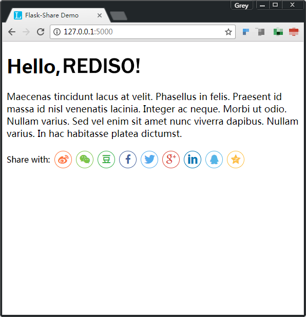

# Flask-Share

Create social share component in Jinja2 template based
on [share.js](https://github.com/overtrue/share.js/).

## USage

Follow the steps described below:

### Installation

$ pip install flask-share

### Initialize

from flask_share import Share
...
share = Share(app)

### Example

Here is a simple demo to demonstrate how to create a share component in template:

## Screenshot

## License

This project is licensed under the MIT License (see the
`LICENSE` file for details).
